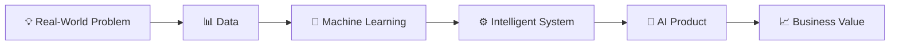

# 👋 Hey, I'm Sepehr Ebadi

### `Computer Engineering` → `Machine Learning` → `AI Products`

 

---

## 🧠 About Me

I'm a **Computer Engineering graduate** focused on **Machine Learning and Artificial Intelligence**, with a strong interest in turning ideas and data into practical intelligent systems.

My journey started with programming and software development and gradually moved toward **data analysis, machine learning, predictive modeling, and AI applications**.

What excites me most is not just training a model — it's understanding a real problem, finding where AI can create value, and turning the solution into something people can actually use.

I'm particularly interested in:

* 🤖 Machine Learning & Artificial Intelligence
* 📊 Data Analysis & Predictive Modeling
* 🧠 Supervised Learning
* 🌳 Gradient Boosting & Tree-Based Models
* 🐍 Python-based ML development
* 🚀 AI-powered applications and products
* 💡 Applying AI to real-world business problems
* 🔬 Research-driven problem solving

> **My goal:** become a strong **Machine Learning Engineer / AI Developer** and build AI-powered products that connect technology, real-world problems, and business value.

---

## 💡 From Machine Learning to AI Products

I want to go beyond **"Can I build an accurate model?"**

I'm interested in questions like:

* Can this model solve a meaningful problem?
* Can it be integrated into a usable product?
* Can the output support better decisions?
* Can AI create measurable value for a business?
* How can a research idea become a practical system?

**That is the direction I want to grow in.**

---

## ⚡ What I Work With

### 💻 Programming & Development

  

### 🤖 Machine Learning & Data

### 🗄️ Databases

### 🛠️ Other Technologies

## 🔬 Featured Research

### 🐄 Improving Transition Cow Index Accuracy

**CatBoost-Based Prediction of First Test-Day Milk Yield**

My main research project focused on improving the prediction of first test-day milk yield using machine learning and applying the results to **Transition Cow Index (TCI)** analysis.

The research was presented at the:

**16th International Conference on Information and Knowledge Technology (IKT), 2025**

**Authors:** Sepehr Ebadi · Hoda Safaeipour

---

## 🚀 Things I'm Building

<table>
<tr>
<td width="50%">

### 🐄 Vahdat ML System

A practical ML application built around a **CatBoost prediction model** for agricultural and dairy analytics.

**Focus:**

* Machine Learning
* CatBoost
* Predictive Analytics
* TCI Analytics
* FastAPI
* Data Processing
* Model Deployment

</td>

<td width="50%">

### 📈 ML Practice

Continuous hands-on work with real datasets and classical ML techniques.

**Focus:**

* Data Cleaning
* EDA
* Feature Engineering
* Regression
* Classification
* Model Evaluation
* Explainable ML

</td>
</tr>
</table>

---

## 🎯 What I Want to Build

|        🧠 AI        | ⚙️ Engineering |    💼 Business   |
| :-----------------: | :------------: | :--------------: |
|   Machine Learning  |  Data → Model  |   Real Problems  |
|    Predictive AI    |   Model → API  | Decision Support |
| Intelligent Systems |  AI → Product  | Measurable Value |

I'm especially interested in opportunities where **Machine Learning meets software engineering and business**.

I want to work on products where AI is not just a feature on paper, but a technology that helps users **make better decisions, automate processes, discover insights, or create measurable value.**

---

## 🔭 Currently Exploring

`Machine Learning` • `AI Engineering` • `Predictive Analytics` • `AI Products` • `Model Deployment` • `Business Applications of AI`

---

## 🌐 Let's Connect

---

### 💙 Thanks for stopping by!

